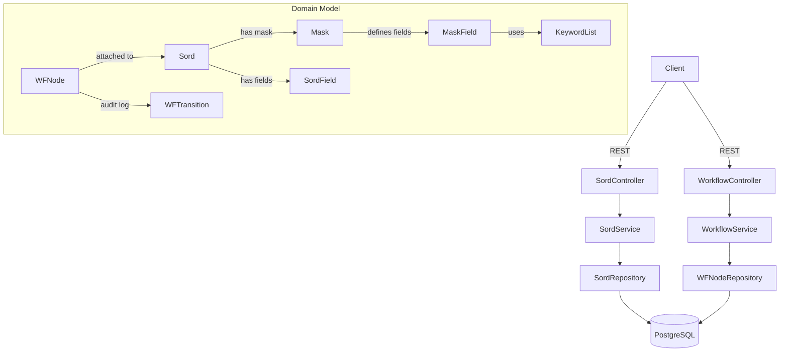

# elo-workflow-demo

[](https://github.com/tdryehthrehre/elo-workflow-demo/actions/workflows/ci.yml)
[](https://openjdk.org/projects/jdk/17/)
[](https://spring.io/projects/spring-boot)
[](LICENSE)

A self-contained Java prototype exploring the core concepts of Enterprise Content Management (ECM),
inspired by the architecture of [ELO Digital Office](https://www.elo.com).

Built as a hands-on learning project to understand ECM fundamentals — Sord hierarchy, Mask-based
typing, keyword-list controlled vocabularies, stateful workflow routing, and audit trails — before
working with production ELO systems.

> **Note:** This is an independent prototype — not affiliated with ELO Digital Office GmbH.
> Terminology is inspired by the public [ELO Indexserver API documentation](https://docs.elo.com),
> but all code is original.

---

## Table of Contents

- [What this demonstrates](#what-this-demonstrates)
- [Architecture](#architecture)
- [Workflow state machine](#workflow-state-machine)
- [Tech stack](#tech-stack)
- [Quick start](#quick-start)
- [Running tests](#running-tests)
- [API overview](#api-overview)
- [End-to-end example](#end-to-end-example)
- [Roadmap](#roadmap)
- [AI Engineering note](#ai-engineering-note)

---

## What this demonstrates

| ECM Concept | Implementation |
|-------------|----------------|
| **Sord** (document object) | `Sord` entity with metadata fields, parent-child hierarchy |
| **Mask** (document type) | `Mask` + `MaskField` entities defining field templates |
| **Keyword lists** | `KeywordList` + `KeywordEntry` for controlled vocabularies |
| **Workflow nodes** | `WFNode` with `WFStatus` state machine (INCOMING → REVIEW → APPROVAL → ARCHIVE) |
| **Audit trail** | Immutable `WFTransition` records per status change |
| **REST API** | Spring Boot controllers with OpenAPI/Swagger documentation |

---

## Architecture



---

## Workflow state machine

```
INCOMING ──► REVIEW ──► APPROVAL ──► ARCHIVE
               │                        (terminal)
               └──► INCOMING  (send back for correction)
               APPROVAL ──► REVIEW  (send back for re-review)
```

Every transition is recorded as an immutable `WFTransition` entry (performer, timestamp, comment),
matching the audit-trail semantics of production ELO installations.

---

## Tech stack

| Layer | Technology |
|-------|-----------|
| Language | Java 17 |
| Framework | Spring Boot 3.2 |
| Persistence | Spring Data JPA, PostgreSQL 16, Flyway migrations |
| API docs | springdoc-openapi (Swagger UI at `/swagger-ui`) |
| Testing | JUnit 5, AssertJ, MockMvc, H2 in-memory |
| Build | Maven 3.9+ |

---

## Quick start

**Prerequisites:** Docker, Java 17+, Maven 3.9+

```bash
# Clone the repo
git clone https://github.com/tdryehthrehre/elo-workflow-demo.git
cd elo-workflow-demo

# Start PostgreSQL
docker compose up -d postgres

# Run the application
./mvnw spring-boot:run
```

The application starts on `http://localhost:8080`.
Swagger UI is available at `http://localhost:8080/swagger-ui`.

---

## Running tests

Tests use an H2 in-memory database — no Docker or external services needed:

```bash
./mvnw test
```

The test suite covers:
- Domain service unit tests (state-machine guard assertions)
- REST layer integration tests via MockMvc (13 tests, all green)
- Flyway migration validation

---

## API overview

| Method | Path | Description |
|--------|------|-------------|
| `POST` | `/api/sords` | Create a document |
| `GET` | `/api/sords/{id}` | Get document by ID |
| `GET` | `/api/sords` | List root-level nodes |
| `GET` | `/api/sords/{id}/children` | List folder children |
| `GET` | `/api/sords/search?q=` | Full-text search |
| `POST` | `/api/sords/{id}/workflow` | Start a workflow |
| `GET` | `/api/sords/{id}/workflow` | Get workflow for document |
| `PUT` | `/api/workflow/{nodeId}/transition` | Transition workflow status |
| `GET` | `/api/workflow?status=REVIEW` | List workflows by status |

---

## End-to-end example

```bash
# 1. Create document
curl -X POST http://localhost:8080/api/sords \
  -H 'Content-Type: application/json' \
  -d '{"shortDescription": "Invoice 2024-042", "maskId": 1,
       "fields": {"amount": "1250.00", "vendor": "Acme Corp"}}'

# 2. Start workflow (returns nodeId)
curl -X POST http://localhost:8080/api/sords/1/workflow \
  -H 'Content-Type: application/json' \
  -d '{"assignee": "alice"}'

# 3. Move to REVIEW
curl -X PUT http://localhost:8080/api/workflow/1/transition \
  -H 'Content-Type: application/json' \
  -d '{"targetStatus": "REVIEW", "performedBy": "alice", "comment": "Looks good"}'

# 4. Approve and archive
curl -X PUT http://localhost:8080/api/workflow/1/transition \
  -H 'Content-Type: application/json' \
  -d '{"targetStatus": "APPROVAL", "performedBy": "bob", "comment": "Approved"}'

curl -X PUT http://localhost:8080/api/workflow/1/transition \
  -H 'Content-Type: application/json' \
  -d '{"targetStatus": "ARCHIVE", "performedBy": "manager", "comment": "Filed Q4/2024"}'
```

---

## Roadmap

Planned next features — tracked as [GitHub Issues](https://github.com/tdryehthrehre/elo-workflow-demo/issues):

- [ ] **ACL system** — per-Sord access control with user/group permissions and inheritance, mirroring ELO's bit-mask rights model
- [ ] **Document versioning** — `SordVersion` entity with major/minor versioning and rollback
- [ ] **Full-text search** — PostgreSQL `tsvector`/`tsquery` with German stemming and GIN index
- [ ] **Spring Security + JWT** — Bearer-token auth integrated with ACL layer
- [ ] **Workflow templates** — editable step/transition model instead of hard-coded state machine
- [ ] **Dockerfile + full compose** — single `docker compose up` to start app + DB

---

## AI Engineering note

This project was developed with AI pair-programming tools to accelerate implementation.
Domain modelling, architecture decisions, and the ELO concept mapping are the author's own work;
AI assistance was used for implementation speed and boilerplate reduction.

---

## Inspired by

- [ELO Indexserver API Documentation](https://docs.elo.com) — public API reference
- ELO ECM Suite — commercial document management system by ELO Digital Office GmbH

## License

MIT
