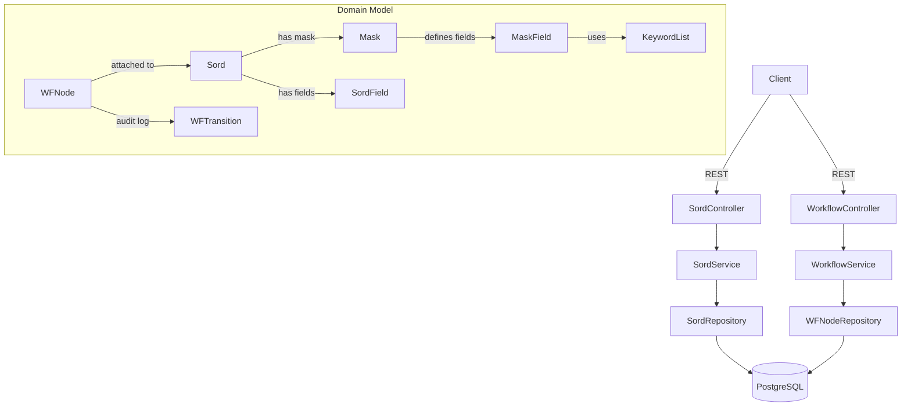

# elo-workflow-demo

A self-contained Java prototype exploring the core concepts of Enterprise Content Management (ECM),
inspired by the architecture of [ELO Digital Office](https://www.elo.com).

Built as a hands-on learning project to understand ECM fundamentals before working with
production systems like ELO.

> **Note:** This is an independent prototype — not affiliated with ELO Digital Office GmbH.
> Terminology is inspired by the public [ELO Indexserver API documentation](https://docs.elo.com),
> but all code is original.

## What this demonstrates

| ECM Concept | Implementation |
|-------------|----------------|
| **Sord** (document object) | `Sord` entity with metadata fields, parent-child hierarchy |
| **Mask** (document type) | `Mask` + `MaskField` entities defining field templates |
| **Keyword lists** | `KeywordList` + `KeywordEntry` for controlled vocabularies |
| **Workflow nodes** | `WFNode` with `WFStatus` state machine (INCOMING → REVIEW → APPROVAL → ARCHIVE) |
| **Audit trail** | Immutable `WFTransition` records per status change |
| **REST API** | Spring Boot controllers with OpenAPI/Swagger documentation |

## Architecture



## Workflow state machine

```
INCOMING ──► REVIEW ──► APPROVAL ──► ARCHIVE
               │                        (terminal)
               └──► INCOMING  (send back for correction)
               APPROVAL ──► REVIEW  (send back for re-review)
```

## Tech stack

- **Java 17**, **Spring Boot 3.2**
- **PostgreSQL 16** (production), **H2** (tests)
- **Spring Data JPA** + **Flyway** migrations
- **springdoc-openapi** (Swagger UI at `/swagger-ui`)
- **JUnit 5** + **AssertJ** + **MockMvc**
- **Maven**

## Quick start

**Prerequisites:** Docker, Java 17+, Maven 3.9+

```bash
# Start PostgreSQL
docker compose up -d postgres

# Run the application
./mvnw spring-boot:run

# Swagger UI
open http://localhost:8080/swagger-ui
```

**Run tests** (uses H2 in-memory, no Docker needed):
```bash
./mvnw test
```

## API overview

| Method | Path | Description |
|--------|------|-------------|
| `POST` | `/api/sords` | Create a document |
| `GET` | `/api/sords/{id}` | Get document by ID |
| `GET` | `/api/sords` | List root-level nodes |
| `GET` | `/api/sords/{id}/children` | List folder children |
| `GET` | `/api/sords/search?q=` | Full-text search |
| `POST` | `/api/sords/{id}/workflow` | Start a workflow |
| `GET` | `/api/sords/{id}/workflow` | Get workflow for document |
| `PUT` | `/api/workflow/{nodeId}/transition` | Transition workflow status |
| `GET` | `/api/workflow?status=REVIEW` | List workflows by status |

### Example: create a document and run it through the workflow

```bash
# 1. Create document
curl -X POST http://localhost:8080/api/sords \
  -H 'Content-Type: application/json' \
  -d '{"shortDescription": "Invoice 2024-042", "maskId": 1,
       "fields": {"amount": "1250.00", "vendor": "Acme Corp"}}'

# 2. Start workflow (returns nodeId)
curl -X POST http://localhost:8080/api/sords/1/workflow \
  -H 'Content-Type: application/json' \
  -d '{"assignee": "alice"}'

# 3. Move to REVIEW
curl -X PUT http://localhost:8080/api/workflow/1/transition \
  -H 'Content-Type: application/json' \
  -d '{"targetStatus": "REVIEW", "performedBy": "alice", "comment": "Looks good"}'

# 4. Approve and archive
curl -X PUT http://localhost:8080/api/workflow/1/transition \
  -H 'Content-Type: application/json' \
  -d '{"targetStatus": "APPROVAL", "performedBy": "bob", "comment": "Approved"}'

curl -X PUT http://localhost:8080/api/workflow/1/transition \
  -H 'Content-Type: application/json' \
  -d '{"targetStatus": "ARCHIVE", "performedBy": "manager", "comment": "Filed Q4/2024"}'
```

## Inspired by

- [ELO Indexserver API Documentation](https://docs.elo.com) — public API reference
- ELO ECM Suite — commercial document management system by ELO Digital Office GmbH

## AI Engineering note

This project was developed with [Claude Code](https://claude.ai/code) as an AI pair-programming
tool. The architecture decisions, domain modelling, and ELO concept mapping are the author's own;
Claude assisted with implementation speed and boilerplate reduction.

## License

MIT
